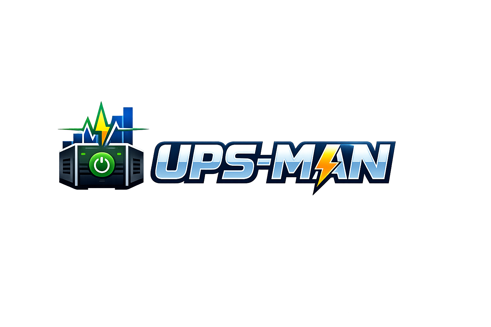

<p align="center">
  
</p>

<p align="center">
  
  
  
</p>

# UPS Vertiv PSL650 - Monitor para QNAP

Monitor de UPS Vertiv PSL650 vía USB usando Docker en QNAP.

---

# 📁 Estructura

```
/share/UPS/ups-docker/
├── app/
│   ├── ups_monitor.py      # Script principal
│   └── requirements.txt    # Dependencias
├── data/
│   ├── ups_status.json     # Estado actual del UPS
│   ├── ups_events.json     # Historial de cortes
│   └── SHUTDOWN_REQUESTED  # Flag de apagado (si aplica)
└── logs/
    └── ups.log             # Logs con rotación (5MB x 3 archivos)
```

---

# 🚀 Comandos útiles

## 📜 Ver estado

```bash
# Logs en vivo
docker -H unix:///var/run/system-docker.sock logs -f vertiv-ups

# Últimas 50 líneas
docker -H unix:///var/run/system-docker.sock logs --tail 50 vertiv-ups

# Estado del contenedor
docker -H unix:///var/run/system-docker.sock ps
```

---

## 📊 Datos del UPS

```bash
# Estado actual (JSON)
cat /share/UPS/ups-docker/data/ups_status.json

# Eventos de corte
cat /share/UPS/ups-docker/data/ups_events.json
```

---

## 🎛 Control del contenedor

```bash
# Parar
docker -H unix:///var/run/system-docker.sock stop vertiv-ups

# Iniciar
docker -H unix:///var/run/system-docker.sock start vertiv-ups

# Reiniciar
docker -H unix:///var/run/system-docker.sock restart vertiv-ups

# Eliminar (conserva datos en /data y /logs)
docker -H unix:///var/run/system-docker.sock rm vertiv-ups
```

---

# ⚙ Configuración

Variables configurables en `docker run`:

| Variable | Default | Descripción |
|-----------|----------|-------------|
| `CHECK_INTERVAL` | 10 | Segundos entre lecturas |
| `SHUTDOWN_VOLTAGE` | 11.0 | Voltaje crítico de batería |
| `SHUTDOWN_DELAY` | 300 | Segundos antes de apagar en corte |

---

# 📊 Datos disponibles

En `ups_status.json`:

- `input_voltage` → Tensión de red (V)
- `battery_voltage` → Tensión de batería (V)
- `load_percent` → Carga conectada (%)
- `on_battery` → true / false
- `timestamp` → Última actualización

---

# 🔋 Apagado automático

El contenedor puede solicitar apagado del NAS cuando:

- Batería < 11.0V
- Corte dura > 5 minutos

Se genera el archivo:

```
/share/UPS/ups-docker/data/SHUTDOWN_REQUESTED
```

Para ejecutarlo, crear script en el NAS:

```bash
# /share/UPS/check_shutdown.sh

if [ -f /share/UPS/ups-docker/data/SHUTDOWN_REQUESTED ]; then
    /sbin/poweroff
fi
```

Se recomienda ejecutarlo periódicamente vía `cron`.

---

# 🧩 Decisiones de Diseño

- Sin dependencias pesadas (no se usa NUT)
- Persistencia en volumen externo
- Diseño tolerante a reinicios del NAS
- Separación clara: app / data / logs
- Integración simple con scripts del sistema

---

# 📄 Licencia

MIT License